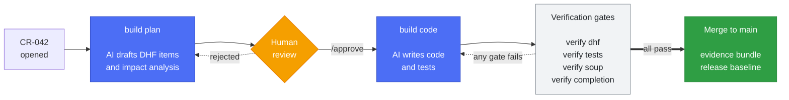

# MedHarness

**AI coding harness for teams shipping software under design control.**

[](https://pypi.org/project/medharness/)
[](LICENSE)
[](https://python.org)

AI can write the code. It cannot tell you which requirement the change serves,
which risk it touches, or whether the traceability still holds — and under IEC
62304 those are the parts that decide whether the work counts.

MedHarness closes that gap. It reads the design behind a change request, drives
the implementation from it, then checks the result against the design again with
ordinary code — no model is asked whether the work is done.

---

## What only it can tell you

Your issue tracker manages one item well. It cannot take every item together and
ask whether the V-model still holds — whether each requirement gives rise to the
next, whether a chain closes back on itself, which risks a change touches. That
analysis is what MedHarness is for, and it reads items as data, so it works
whether they live in YAML here or in Jira.

```console
$ medharness --dhf DHF verify dhf
FAIL [cycle] SRS-014 → SYS-006 → SRS-014
    Fix: the V-model is directed. Remove whichever link reverses the chain so each item has an origin.
FAIL [required] SRS-022: SRS derives_from → SYS (count=0, need ≥1)
WARN [coverage] RISK→RCM: 3/4 covered
    Fix: dhfkit --dhf DHF item list --type RCM to find uncovered items, then add dhf_links to their YAML.
         Advisory only — pass --fail-on-uncovered to block the build on this.
Error: DHF validation failed.
```

A cycle means two items each derive from the other, so neither has an origin and
the matrix loses the direction that makes it a matrix. A missing required link
means a requirement traces to nothing above it. Both are structural — they block.

Incomplete design (`WARN`) blocks only under `--fail-on-uncovered`, because it is
design still to be written. Conflating the two is what makes traceability checks
something teams learn to ignore.

Storage-level checks — schema, and links whose target does not exist — come from
`dhfkit` and run in the same pass. A backend that enforces referential integrity
of its own makes them redundant; the analysis above it does not go away.

---

## How a change moves

Every change is a Change Request on a fixed path. AI drafts, humans approve,
deterministic gates decide whether it can close.



Only the blue steps call a model. Everything in the verification band is
ordinary code. See [docs/ai-security.md](docs/ai-security.md) for the boundary
in detail — including how to run with no AI at all.

---

## Install

```bash
mkdir my-device && cd my-device
python -m venv .venv && source .venv/bin/activate
pip install medharness
medharness init
```

`medharness init` scaffolds `DHF/` (config, items, documents), `AI-harness/`,
and prompt templates. Extras: `medharness[ai]` for the AI workflow,
`medharness[docs]` for PDF export, `medharness[full]` for both.

Check the environment at any point:

```bash
medharness doctor
```

### Before enabling the AI stages

`build plan` and `build code` need a model CLI or API key, which pip
cannot install:

```bash
npm install -g @anthropic-ai/claude-code   # default path, provides the `claude` CLI
```

**Read [docs/ai-security.md](docs/ai-security.md) first.** These stages run an
agentic loop with an unrestricted shell tool and are designed for an ephemeral
CI runner, not a workstation holding your credentials.

Everything else — traceability, validation, gates, evidence bundles — is
deterministic and needs no model access.

---

## First change request

```bash
git init && git add -A && git commit -m "feat: initialize DHF"

# Edit DHF/items/07_cr/CR-001.yaml, then:
medharness --dhf DHF build plan --cr CR-001       # AI drafts DHF items + impact analysis
# review and approve the design PR, then:
medharness --dhf DHF build code --cr CR-001  # AI writes code and tests
medharness --dhf DHF verify dhf                    # gates decide whether it can close
```

---

## Deploy to CI

MedHarness does not install a CI workflow — it would reference your branch
names, runners, and secrets, and `medharness upgrade` will never overwrite it.
Pin the version and call the gates:

```yaml
name: DHF
on:
  pull_request:
    paths: ['DHF/**']

jobs:
  dhf-validate:
    runs-on: ubuntu-latest
    steps:
      - uses: actions/checkout@v4
      - uses: actions/setup-python@v5
        with:
          python-version: '3.11'
      - run: pip install medharness==0.33.1
      - run: medharness --dhf DHF verify dhf --fail-on-uncovered
```

Drop `--fail-on-uncovered` while backfilling an existing DHF: coverage gaps then
report as `WARN`, and only schema, required links, and dangling links block.

`medharness verify --help` lists the gates; each subcommand's `--help` gives its options.
[docs/interface.md](docs/interface.md) is the contract to build against — result
shape, exit codes, and what may change.
[docs/adopting.md](docs/adopting.md#setting-up-ci) carries the full workflow
with evidence bundles and release baselines.

---

## Commands

`dhfkit` owns DHF **data** — storage and retrieval, no analysis. `medharness`
owns the **analysis over the item set** and the process around it. A team whose
DHF already lives in Jira or Azure DevOps keeps that and still needs the
analysis.

Both take `--dhf DHF`; `dhfkit` also reads `COMPLIANTFLOW_DHF`.
Every command writes JSON to stdout and human-readable lines to stderr, so
`cmd > out.json` gives you the payload and the terminal still reads normally.

**Gates** — `verify *` and `workflow *` — all answer with the same
envelope, so one CI step can handle any of them:

```json
{"gate": "verify dhf", "passed": false,
 "summary": "13 item(s) checked; 1 error(s), 3 warning(s).",
 "errors": ["Traceability cycle: CRS-001 -> SYS-001 -> CRS-001"],
 "warnings": ["CRS-001 states no verification criterion — §5.7 needs one"]}
```

`0` the gate passed · `1` it failed (JSON on stdout) or a usage error was raised
before it ran (no stdout) · `2` argument parsing failed.

That is the whole answer: the verdict, and every finding as a line you can
print. A gate that answered only `false` could not be acted on, so the findings
come with it — but nothing more. `summary` says what was checked, which is how
you tell a real pass from a gate that examined nothing.

### `verify` — what the DHF says

Answers from the DHF alone. No remote, no branch, no PR: these run the same on a
laptop as in CI. `verify completion` reads a CR item from the DHF; it does not
need the pull request that carries it.

| Command | Use it when |
|---|---|
| `medharness verify dhf` | Every push. This is the one gate a DHF cannot do without: it is the only check that reads the items *together* and asks whether the V-model closes. |
| `medharness verify tests --junit-dir test-results` | After the test job, to prove each requirement was verified **by the method it declared** — a Test-verified requirement needs a passing linked test, not just any evidence. |
| `medharness verify soup --manifest requirements.txt` | Nightly and before a release. Answers both §8.1.2 questions at once: is the register what actually ships, and is any of it known-vulnerable. `--offline-mode warn` for air-gapped runners. |
| `medharness verify completion --cr CR-034 --junit-dir test-results` | Twice. On the branch to block the merge — the CR fields and the proposed items settle there. Again on `main`, where the tests re-run against whatever else landed. Reports only items **this CR** touched. Approval is not its question: that is `workflow check-approval`. |

### `build` — what it produces

| Command | Returns | Use it when |
|---|---|---|
| `medharness build plan --cr CR-034` | `outcome`, `items_changed`, `review_cycles`, `diagnostics` | The CR has been triaged. Drafts the whole DHF item cascade and the impact analysis, then validates its own output and fixes what it broke. |
| `medharness build code --cr CR-034` | `outcome`, `files_changed`, `review_cycles` | The design is approved. Writes code and tests against the cascade. `--pr 42` revises from review feedback; `--ci-failures` from a failing run. |
| `medharness build dhf --manifest requirements.txt --write` | `to_create`, `to_update`, `orphans`, `items_created`, `items_updated` | A dependency changed. Reconciles the SOUP register with the project's manifests. Without `--write` it reports only — read that first: it writes items you then have to fill in a purpose and risk rating for. |

### `workflow` — what Git and GitHub say

CI helper scripts. They cannot answer without the repository, which is why they
are not under `verify`; a developer working locally never needs them.

| Command | Returns | Use it when |
|---|---|---|
| `medharness workflow check-changes --cr CR-034` | the gate envelope | On the PR. Checks the branch actually changed the items the CR listed in `affected_items` — a CR that promised to touch SYS-001 and did not is caught before review, not after. |
| `medharness workflow check-approval --cr CR-034 --pr 42` | the gate envelope | Before merging, at each stage that needs a sign-off. Requires an approving GitHub review of the exact commit the PR would merge; an approval of an earlier commit is stale and fails. That is also what keeps the stages honest — a design approval expires the moment code lands, so the develop stage needs its own. Needs `GH_TOKEN`. |
| `medharness workflow github-event` | `cr_id`, `stage`, `pr_number`, `reason`, and two verdicts: **`action`** — what your own `--review-action` / `--branch-stage` mappings decided, an opaque string this tool never interprets, and which is the one to branch on; `mode` — this tool's own reading (`new` / `iterate` / `cancel` / `skip`), which is only what `action` falls back to when no mapping matches. They differ whenever a mapping fires. | First step of a workflow, so it branches on one command's output instead of a ladder of `if` expressions. Not a gate: it exits 0 whatever it finds. |

### Context for an agent

All three print JSON to stdout and make no changes.

| Command | Returns | Use it when |
|---|---|---|
| `medharness context overview` | `project`, `item_count`, `items`, `traceability`, `test_coverage` | An agent or a person is new to the DHF. `traceability.valid` is the same verdict `verify dhf` reaches. Pass `--junit-dir` to get real test coverage instead of `{"computed": false}`. |
| `medharness context implementation --cr CR-034` | `project`, `cr` (the full item), `items`, `traceability`, `module_map` | An agent is about to write code for a CR: which modules own which designs and requirements. |
| `medharness context for-stage develop --cr CR-034` | `stage`, `cr`, `affected_items` (or `traceability_gaps` at `analyze`) | You want the smaller answer — only what one stage needs, rather than the whole DHF. |

### Evidence and release

Not under a verb yet: merging these into `build release` is agreed and not built.

| Command | Returns | Use it when |
|---|---|---|
| `medharness evidence bundle --out-dir artifacts` | `gate_passed`, `manifest`, `artifacts` | On merge to `main`. Runs the acceptance gate and writes the read-only bundle an auditor reads: specifications, plans, traceability, test evidence, SBOM, and a manifest with a hash per file. `--doc-format pdf` needs `medharness[docs]`. |
| `medharness release baseline --version 1.0.0 --write` | `version`, `cr_ids`, `rel_uid`, `artifacts`, `soup_count` | Cutting a release (IEC 62304 §9). Verifies every included CR is `completed`, freezes the software BOM, and writes the REL item. Dry-run without `--write`. |

### Setting up and keeping current

| Command | Returns | Use it when |
|---|---|---|
| `medharness init` | list of created paths | Once, in an empty project. Scaffolds the DHF, the AI harness, and a CI workflow. Never overwrites. |
| `medharness upgrade` | `outdated`, `missing`, `up_to_date`, `installed_version` | After upgrading the package. Reports scaffold drift; `--apply` writes it. Your DHF items, `global.yaml` and `context.md` are never touched. |
| `medharness doctor` | `checks`, `passed`, `failed` | CI is behaving oddly. Checks Python, the CLIs, `gh` auth, and whether the DHF config and adapter load. |

### Storing and reading the DHF — `dhfkit`

| Command | Returns | Use it when |
|---|---|---|
| `dhfkit item list --type SYS` | one JSON object per line | Enumerating items of a type. |
| `dhfkit item get SRS-012` | the item, with `all_linked_uids` resolved | You need one item's fields and links. |
| `dhfkit item create --type SRS --data '{...}'` | the created item, with its assigned ID | Adding an item. The ID is allocated for you. |
| `dhfkit item update SRS-012 --data '{...}'` | the updated item | Changing fields. The JSON is merged, not replaced; editing an approved item returns it for re-approval. |
| `dhfkit item transition CR-034 completed` | the item in its new state | Moving an item through its lifecycle. Omit the state to get the transitions available and which criteria block the rest. |
| `dhfkit validate schema` | `valid`, `item_count`, `errors` | Before committing. Every item against its doc-type schema. |
| `dhfkit doc generate SYS` | `doc_type`, `output_path`, `version` | Building a specification document from the items. |
| `dhfkit doc export SYS --format pdf` | `output_path` | Handing a specification to someone outside the repo. HTML is self-contained; PDF needs `[docs]`. |
| `dhfkit sbom` | `path`, `components`, `without_purl` | You need a CycloneDX 1.6 SBOM from the SOUP register. `without_purl` counts the components no tool downstream can match. |
| `dhfkit init` | list of created paths | You want the DHF without the AI harness. |

Attribution is the commit, not a flag: `dhfkit` does not commit, so who changed
an item is whoever authored the commit that carried it.

`--help` on any subcommand carries the full surface.

**Model configuration.** Each stage falls back to the Anthropic Claude CLI
unless you set `MEDHARNESS_{DESIGN,DESIGN_REVIEW,DEVELOP,CODE_REVIEW}_MODEL` to
a `provider:model` value — `anthropic`, `openai` (`OPENAI_API_KEY`), or
`deepseek` (`DEEPSEEK_API_KEY`). `MEDHARNESS_{STAGE}_BASE_URL` points a stage at
Azure, Ollama, or vLLM. `GH_TOKEN` is required for `--pr`.

---

## Seeing it run

[**ContourLab**](https://github.com/itercharles/ContourLab) is a browser-based
contouring workspace for radiation oncology, maintained end-to-end with
MedHarness. Its `DHF/` holds the real design inputs and traceability, every
change goes through the CR path above, and CI runs the gates on every PR. If you
want to read a production adoption before committing to one, start there.

---

## Documentation

| | |
|---|---|
| [docs/adopting.md](docs/adopting.md) | starting fresh, migrating an existing DHF, incremental adoption |
| [docs/interface.md](docs/interface.md) | the machine interface — result envelope, exit codes, stability |
| [docs/ai-security.md](docs/ai-security.md) | what the AI stages can do, isolation, audit trail, no-AI operation |
| [docs/architecture.md](docs/architecture.md) | package boundaries, CR topology, scaffold layout |
| [docs/adr/](docs/adr/) · [CHANGELOG.md](CHANGELOG.md) | decision records; version history |
| [CONTRIBUTING.md](CONTRIBUTING.md) | contributor setup and local development |

`dhfkit` has no dependency on `medharness`, so the DHF engine can be adopted
standalone.

---

## License

MIT. See [LICENSE](LICENSE).
