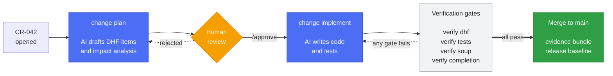

# MedHarness

**AI coding harness for design-controlled medical software teams.**

[](https://pypi.org/project/medharness/)
[](LICENSE)
[](https://python.org)

MedHarness is an AI coding harness for medical software teams that need implementation to stay grounded in design inputs, traceability, and controlled verification.

The core value is that MedHarness can automatically analyze the design context behind a change, drive implementation from that design, and then verify the result against the design again.

That design analysis can include customer needs, software requirements, detailed design, SOUP, risk-related items, and the traceability already attached to the change request. For each change request, MedHarness also generates the impact analysis and traceability updates needed to keep the work controlled.

MedHarness brings together:

- an AI coding workflow that analyzes the impacted design, prepares the implementation path, writes code and tests, and verifies the resulting change against the design
- `dhfkit`, a traceability layer that can work in Git-based workflows or alongside systems such as Jira and Rally
- deterministic validation and pipeline hooks that make the delegated work reviewable and auditable

---

## How a change moves

Every change is a Change Request that walks a fixed path. AI drafts; humans approve; deterministic gates decide whether it can close.



The blue steps are the only ones that call a model. Everything in the verification band is ordinary code — it does not ask an LLM whether the work is done. See [docs/ai-security.md](docs/ai-security.md) for the boundary in detail.

---

## What it catches

`verify dhf` on a DHF where a risk control points at a risk that no longer exists:

```console
$ medharness --dhf DHF verify dhf
PASS [schema]: 13 items valid
FAIL [dangling] RCM-001.mitigates → RISK-404: target does not exist
    Fix: correct the ID in RCM-001.yaml, or create RISK-404. The link exists but resolves to nothing.
PASS [coverage] UC→CRS: 1/1 covered
PASS [coverage] CRS→SYS: 1/1 covered
PASS [coverage] SYS→SRS: 1/1 covered
PASS [coverage] SRS→SWDD: 1/1 covered
PASS [coverage] SYS→SYSARCH: 1/1 covered
PASS [coverage] MODULE→SWDD: 1/1 covered
WARN [coverage] RISK→RCM: 0/1 covered
    Fix: dhfkit --dhf DHF item list --type RCM to find uncovered items, then add dhf_links to their YAML.
         Advisory only — pass --fail-on-uncovered to block the build on this.
Error: DHF validation failed.
```

Broken references (`FAIL`) always block. Incomplete-but-valid design (`WARN`) blocks only with `--fail-on-uncovered`, which the scaffolded CI workflow enables. The distinction matters: a dangling link is a typo to correct, an uncovered item is design still to be written.

---

## Why teams use it

Medical software teams need more than code generation. They need a harness that can safely take work off engineers without breaking traceability or review discipline.

They still need clear answers to:

- What changed, and why?
- Which requirements, risks, and design items were affected?
- Which tests verify each requirement?
- What evidence was produced for this release?

MedHarness is built around those questions.

| Problem | What MedHarness does |
|---------|----------------------|
| Engineers spend time on repetitive bugfix and small-change work | Runs an AI coding workflow designed to handle controlled low-risk changes |
| AI output is hard to govern in regulated environments | Keeps AI inside explicit CR stages with validation and approval gates |
| DHF data already lives in existing systems | Uses `dhfkit` as a traceability layer that can fit Git-based workflows or adapt to tools like Jira and Rally |
| Traceability breaks as code moves | Validates links across CR, requirement, risk, design, and test artifacts |
| Release evidence is assembled manually | Produces evidence bundles and release baselines from repository state and test artifacts |
| Adoption feels all-or-nothing | Lets teams adopt the harness, `dhfkit`, and pipeline checks independently |

This repo is not trying to be a full QMS. It is focused on controlled AI-assisted software execution for teams that still need DHF-grade traceability around the work.

---

## Getting started

```bash
mkdir my-device && cd my-device
python -m venv .venv
source .venv/bin/activate
pip install medharness[full]
medharness init
```

Use `pip install medharness` for a minimal install.

Optional extras:

- `medharness[ai]` for AI-assisted workflows
- `medharness[docs]` for document export
- `medharness[full]` for both

### If you plan to use the AI workflow

The `change plan` and `change implement` stages need one more thing that pip cannot install — a model CLI or API key:

```bash
npm install -g @anthropic-ai/claude-code   # default path, provides the `claude` CLI
```

Or set `MEDHARNESS_*_MODEL` to use an OpenAI-compatible provider instead (see [Core commands](#ai-coding-workflow)).

Verify your environment at any time:

```bash
medharness doctor
```

**Before enabling AI stages, read [docs/ai-security.md](docs/ai-security.md).** These stages run an agentic loop with an unrestricted shell tool, and are designed to run on an ephemeral CI runner rather than a workstation holding your credentials.

Everything else — traceability, validation, verification gates, evidence bundles — is deterministic and needs no model access at all.

This creates a starter structure like:

```text
my-device/
├── DHF/
│   ├── config/
│   ├── items/
│   │   ├── 01_crs/
│   │   ├── 02_sys/
│   │   ├── 03_srs/
│   │   ├── 07_cr/
│   │   └── ...
│   └── documents/
├── AI-harness/
│   └── context.md
└── .github/
    └── prompts/
```

CI is not scaffolded — the pipeline references your branch names, runners, and secrets, so you own it. [docs/adopting.md](docs/adopting.md#setting-up-ci) carries a ready-to-paste `.github/workflows/dhf.yml`.

### Create your first controlled baseline

Replace the sample items with your own project content, then commit:

```bash
git init
git add -A
git commit -m "feat: initialize DHF"
```

### Run the first CR

Edit `DHF/items/07_cr/CR-001.yaml`, then run:

```bash
medharness --dhf DHF change plan --cr CR-001
```

After the design PR is reviewed and approved:

```bash
medharness --dhf DHF change implement --cr CR-001
```

The scaffolded workflow validates DHF updates on PRs and can build evidence on merge to `main`.

### Adopting with existing systems

You do not need to replace Jira, Rally, or another existing system of record to use MedHarness.

`dhfkit` can be used as the traceability and control layer around an existing workflow, while MedHarness provides the design analysis, implementation, and verification path for controlled changes.

Interoperability with systems such as Jira and Rally is under development.

---

## Core commands

### DHF and traceability

```bash
cd my-device

dhfkit --dhf DHF item list --type SYS
dhfkit --dhf DHF item get CR-034
dhfkit --dhf DHF validate schema
dhfkit --dhf DHF validate traceability
dhfkit --dhf DHF doc generate SYS
dhfkit --dhf DHF doc export SYS              # standalone styled HTML
dhfkit --dhf DHF doc export ALL --format pdf # needs medharness[docs]
dhfkit --dhf DHF report
```

Specifications export to self-contained HTML by default — no native libraries, so it works on a base install and the output can be committed, published, or handed to a reviewer as-is. PDF is available with the `docs` extra, which additionally needs WeasyPrint's cairo/pango stack.

This is only a small subset of the `dhfkit` surface. For item creation, updates, config inspection, test results, and other DHF operations, see `dhfkit --help` and the relevant subcommand help such as `dhfkit item --help`.

### AI coding workflow

```bash
medharness --dhf DHF change plan --cr CR-034
medharness --dhf DHF change implement --cr CR-034
```

If you are revising from PR feedback:

```bash
medharness --dhf DHF change plan --cr CR-034 --pr 42
medharness --dhf DHF change implement --cr CR-034 --pr 42
```

**Environment variables**

| Variable | Purpose |
|---|---|
| `GH_TOKEN` | Required when using `--pr` to fetch PR feedback |
| `ANTHROPIC_MODEL` | Override the default Claude model for all stages |
| `MEDHARNESS_DESIGN_MODEL` | LLM for `change plan` generation (e.g. `openai:gpt-4o`) |
| `MEDHARNESS_DESIGN_REVIEW_MODEL` | LLM for the design review loop |
| `MEDHARNESS_DEVELOP_MODEL` | LLM for `change implement` generation |
| `MEDHARNESS_CODE_REVIEW_MODEL` | LLM for the code review loop |
| `MEDHARNESS_{STAGE}_BASE_URL` | Override the API endpoint for a stage (Azure, Ollama, vLLM, …) |

Each `MEDHARNESS_*_MODEL` variable takes a `provider:model` value. Supported providers: `anthropic` (default, uses the Claude CLI), `openai` (requires `OPENAI_API_KEY`), `deepseek` (requires `DEEPSEEK_API_KEY`). Any stage without a `MEDHARNESS_*_MODEL` env var falls back to the Anthropic Claude CLI. Set `MEDHARNESS_{STAGE}_BASE_URL` to point a stage at a custom endpoint (e.g. `https://my-resource.openai.azure.com/openai/deployments/gpt4o`).

### Verification

```bash
medharness --dhf DHF verify dhf
medharness --dhf DHF verify tests --junit-dir test-results
medharness --dhf DHF verify branch --cr CR-034
medharness --dhf DHF verify code --cr CR-034
medharness --dhf DHF evidence bundle --out-dir artifacts
```

### SOUP management

```bash
dhfkit --dhf DHF soup-sync --manifest <dependency-manifest>
```

### Release baseline

```bash
dhfkit --dhf DHF release-baseline --version 1.0.0 --out-dir artifacts/release
```

For more on dependency tracking and release documentation, see [docs/adopting.md](docs/adopting.md).

### PR/stage automation

```bash
medharness --dhf DHF change status --cr CR-034 --pr 42
medharness --dhf DHF approval check --cr CR-034 --stage design --pr 42
medharness --dhf DHF change advance --pr 42 --from-stage design --to-stage develop
medharness --dhf DHF approval parse --comment "$COMMENT_BODY"
```

These commands are designed to integrate cleanly with automation.

---

## Who this fits

- medical device and SaMD teams working under IEC 62304, FDA 21 CFR 820.30, or MDR
- teams that want AI to carry controlled changes without losing review control
- organizations that already have requirements or work tracking in systems like Jira or Rally and still need a usable traceability layer
- engineering teams that want their senior developers focused more on major feature development than on repetitive controlled changes

---

## Real-world example

[**ContourLab**](https://github.com/itercharles/ContourLab) is a browser-based contouring workspace for radiation oncology — a real SaMD product maintained entirely with MedHarness.

Its repository shows what production adoption looks like end-to-end:

- `DHF/` holds all design inputs, traceability items, and generated specifications
- every change goes through a CR with `change plan` → design review → `change implement` → verification gates
- the CI pipeline runs `verify dhf`, `verify tests`, and `evidence bundle` on every PR
- SOUP items are managed with `dhfkit soup-sync` and scanned for CVEs via `verify soup`
- releases produce a signed release baseline and software BOM

If you want to see MedHarness running on a real codebase before adopting it, ContourLab is the reference.

---

## Documentation

- [CONTRIBUTING.md](CONTRIBUTING.md): contributor setup and local development
- [docs/adopting.md](docs/adopting.md): starting fresh, migrating an existing DHF, and incremental adoption
- [docs/ai-security.md](docs/ai-security.md): what the AI stages can do, isolation guidance, audit trail, and how to run with no AI at all
- [docs/architecture.md](docs/architecture.md): package boundaries, CR workflow, and scaffold topology
- [docs/adr/](docs/adr/): architecture decision records
- [CHANGELOG.md](CHANGELOG.md): version history

---

## Repository layout

| Directory | Purpose |
|-----------|---------|
| `medharness/` | harness CLI, verification, change workflows, scaffolding |
| `dhfkit/` | DHF engine: items, lifecycle, traceability, document generation |
| `dhfkit/templates/` | starter DHF scaffold and templates |
| `tests/` | MedHarness and `dhfkit` test suites |
| `docs/` | architecture docs and ADRs |

`dhfkit` has no dependency on `medharness`, so the DHF engine can be adopted standalone.

---

## License

MIT. See [LICENSE](LICENSE).
