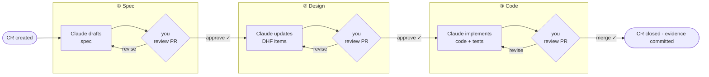

# MedHarness

**Design-controlled AI development for medical device software.**

[](https://pypi.org/project/medharness/)
[](LICENSE)
[](https://python.org)

---

## What this is

Building software for a medical device means every requirement, risk, architectural decision, and test has to be traced and documented in a **Design History File (DHF)** — before code ships, and in a form that holds up under FDA or notified body scrutiny.

That's a real documentation burden. Teams spend meaningful engineering time on traceability matrices, impact assessments, and evidence bundles — work that doesn't ship features but is genuinely required to ship regulated products.

MedHarness makes that work AI-assisted without making it ungoverned. It gives Claude a structured role in your DHF workflow — writing specs, updating design items, implementing code — while keeping you in the loop at every approval gate. The agent executes; you decide when to advance.

---

## How it works

Every non-trivial change flows through a **Change Request (CR)** in the DHF. MedHarness runs Claude at each stage, validates the output deterministically, and opens a PR for your review before anything moves forward.



At each stage, MedHarness pre-computes DHF context — item lists, traceability graph, coverage gaps — and injects it into Claude's prompt so the agent reasons about your actual DHF rather than guessing. After Claude runs, a deterministic validator checks schema, traceability links, and test annotations, and self-corrects if it can. Only then does a PR open for your review.

---

## Who it's for

- **Medical device software teams** working under IEC 62304, FDA 21 CFR 820.30, or MDR who want AI help that doesn't bypass the process
- **Platform / DevOps engineers** building regulated CI pipelines who need programmatic hooks into DHF validation and evidence generation
- **Startups** bootstrapping a DHF alongside their product without a dedicated RA team writing everything by hand

`dhfkit` — the DHF engine inside MedHarness — also works standalone if you only need YAML-based item storage, traceability graphs, and document generation without the full CR workflow.

---

## Install

```bash
pip install medharness[full]
```

`[full]` includes optional extras: `ai` (AI review) and `docs` (PDF export via WeasyPrint). Leave it off for a minimal install — `dhfkit` is always included either way.

```bash
medharness --help
dhfkit --help
```

**From source:**

```bash
git clone https://github.com/itercharles/MedHarness
cd MedHarness
pip install -e ".[dev]"
pytest dhfkit/tests/ tests/
```

---

## Quick start

`medharness init` scaffolds a complete DHF project in the current directory — no prompts, nothing to fill out:

```bash
mkdir my-device && cd my-device
python -m venv .venv && source .venv/bin/activate
pip install medharness
medharness init
```

You get a working DHF with sample requirements, risks, traceability config, document templates, and plans — ready to replace with your real content:

```
my-device/
├── DHF/
│   ├── config/           # project name, lifecycle states, doc type schemas
│   ├── items/            # one YAML file per requirement, risk, CR, etc.
│   │   ├── 01_crs/       # Customer Requirements
│   │   ├── 02_sys/       # System Requirements
│   │   ├── 03_srs/       # Software Requirements
│   │   ├── 06_cr/        # Change Requests
│   │   └── ...           # Use Cases, SOUP, Risk, RCM, Defects
│   ├── documents/        # Jinja2 spec templates and plan documents
│   └── test-results/
├── CLAUDE.md             # AI agent entrypoint
└── README.md
```

Then push it to git and you're tracking your DHF from day one:

```bash
git init && git add -A && git commit -m "feat: initialize DHF"
```

---

## The CR workflow in practice

```bash
# Stage 1 — Claude writes the spec, validates it, opens a PR
medharness --dhf DHF ci analyze-cr --cr CR-034

# Stage 2 — after you approve the spec PR, Claude creates DHF items
medharness --dhf DHF ci design-cr --cr CR-034

# Stage 3 — after you approve the design PR, Claude implements the code
medharness --dhf DHF ci develop-cr --cr CR-034
```

Got review comments on a PR? Pass `--pr N` to any command to revise based on the feedback:

```bash
medharness --dhf DHF ci analyze-cr --cr CR-034 --pr 42
```

`ANTHROPIC_MODEL` selects the Claude model. `GH_TOKEN` is required when using `--pr`.

Each command outputs structured JSON with outcome, errors, timing, and artifact paths — so CI automation can act on results without parsing text.

---

## CI gates

Three gates you'd typically run before a PR merges:

**DHF schema and traceability**
```bash
medharness ci dhf-validate --dhf DHF
```
Validates item schemas, required fields, and traceability links across the entire DHF.

**Requirement-to-test coverage**
```bash
medharness ci test-coverage --dhf DHF --junit-dir test-results
```
Reads JUnit XML test results and checks that every verifiable requirement has at least one linked passing test. Tests link to DHF items via a `medharness.links` property in their JUnit output. Exits non-zero when gaps exist.

**Evidence bundle**
```bash
medharness ci evidence bundle --dhf DHF --out-dir artifacts --junit-dir test-results
```
Produces a timestamped DHF snapshot and test evidence archive on merge to `main`.

---

## Automation model

MedHarness ships no prescribed CI workflow files — the stable interface is the CLI. Wire it into whatever automation layer fits your team (GitHub Actions, GitLab CI, Jenkins, local scripts):

```bash
# DHF operations
medharness --dhf DHF dhf item list --type SYS
medharness --dhf DHF dhf validate schema
medharness --dhf DHF dhf validate traceability
medharness --dhf DHF dhf doc generate SYS
medharness --dhf DHF dhf doc export SYS        # PDF (requires [docs])

# CR workflow
medharness cr workflow intake-github-issue-ci
medharness cr workflow complete-from-github-pr

# CI gates
medharness ci dhf-validate --dhf DHF
medharness ci test-coverage --dhf DHF --junit-dir test-results
medharness ci evidence bundle --dhf DHF --out-dir artifacts
medharness --dhf DHF ci validate-design --cr CR-034
medharness --dhf DHF ci validate-code --cr CR-034

# Status surface (machine-readable, for automation routing)
medharness ci cr-status --cr CR-034 --stage spec --pr 18
medharness ci github-event --event "$GITHUB_EVENT_PATH"
```

---

## Python API

```python
from medharness.client import DHFClient

client = DHFClient(Path("DHF"))
cr   = client.get_item("CR-034")
spec = client.get_cr_context("CR-034")   # {"cr": {...}, "spec": "..."}
client.transition_item("CR-034", "in_review", performed_by="alice")
```

`dhfkit` standalone — no dependency on `medharness`:

```python
from dhfkit.local_adapter import LocalDHFAdapter

adapter = LocalDHFAdapter(Path("DHF"))
items   = adapter.list_items("SRS")
```

---

## Repository layout

| Directory | Purpose |
|-----------|---------|
| `medharness/` | CLI harness, CI gates, CR workflows, `init` scaffolding |
| `dhfkit/` | DHF engine: items, lifecycle, traceability, document generation |
| `dhfkit/templates/` | Starter DHF scaffold — config, specs, plans, sample items |
| `tests/` | MedHarness and dhfkit test suites |
| `docs/` | Architecture, ADRs, compatibility contracts |

`dhfkit` has no dependency on `medharness` and can be used on its own.

---

## Docs

- [docs/architecture.md](docs/architecture.md) — packages, scaffold model, DHF lifecycle
- [docs/compatibility-contracts.md](docs/compatibility-contracts.md) — stable public contracts
- [docs/adr/](docs/adr/) — architecture decision records
- [CHANGELOG.md](CHANGELOG.md) — version history

---

## License

MIT — see [LICENSE](LICENSE).
