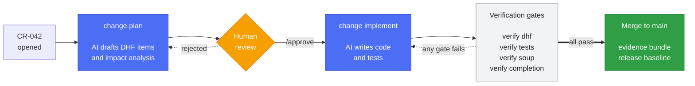

# MedHarness

**AI coding harness for teams shipping software under design control.**

[](https://pypi.org/project/medharness/)
[](LICENSE)
[](https://python.org)

AI can write the code. It cannot tell you which requirement the change serves,
which risk it touches, or whether the traceability still holds — and under IEC
62304 those are the parts that decide whether the work counts.

MedHarness closes that gap. It reads the design behind a change request, drives
the implementation from it, then checks the result against the design again with
ordinary code — no model is asked whether the work is done.

---

## What only it can tell you

Your issue tracker manages one item well. It cannot take every item together and
ask whether the V-model still holds — whether each requirement gives rise to the
next, whether a chain closes back on itself, which risks a change touches. That
analysis is what MedHarness is for, and it reads items as data, so it works
whether they live in YAML here or in Jira.

```console
$ medharness --dhf DHF verify dhf
FAIL [cycle] SRS-014 → SYS-006 → SRS-014
    Fix: the V-model is directed. Remove whichever link reverses the chain so each item has an origin.
FAIL [required] SRS-022: SRS derives_from → SYS (count=0, need ≥1)
WARN [coverage] RISK→RCM: 3/4 covered
    Fix: dhfkit --dhf DHF item list --type RCM to find uncovered items, then add dhf_links to their YAML.
         Advisory only — pass --fail-on-uncovered to block the build on this.
Error: DHF validation failed.
```

A cycle means two items each derive from the other, so neither has an origin and
the matrix loses the direction that makes it a matrix. A missing required link
means a requirement traces to nothing above it. Both are structural — they block.

Incomplete design (`WARN`) blocks only under `--fail-on-uncovered`, because it is
design still to be written. Conflating the two is what makes traceability checks
something teams learn to ignore.

Storage-level checks — schema, and links whose target does not exist — come from
`dhfkit` and run in the same pass. A backend that enforces referential integrity
of its own makes them redundant; the analysis above it does not go away.

---

## How a change moves

Every change is a Change Request on a fixed path. AI drafts, humans approve,
deterministic gates decide whether it can close.



Only the blue steps call a model. Everything in the verification band is
ordinary code. See [docs/ai-security.md](docs/ai-security.md) for the boundary
in detail — including how to run with no AI at all.

---

## Install

```bash
mkdir my-device && cd my-device
python -m venv .venv && source .venv/bin/activate
pip install medharness
medharness init
```

`medharness init` scaffolds `DHF/` (config, items, documents), `AI-harness/`,
and prompt templates. Extras: `medharness[ai]` for the AI workflow,
`medharness[docs]` for PDF export, `medharness[full]` for both.

Check the environment at any point:

```bash
medharness doctor
```

### Before enabling the AI stages

`change plan` and `change implement` need a model CLI or API key, which pip
cannot install:

```bash
npm install -g @anthropic-ai/claude-code   # default path, provides the `claude` CLI
```

**Read [docs/ai-security.md](docs/ai-security.md) first.** These stages run an
agentic loop with an unrestricted shell tool and are designed for an ephemeral
CI runner, not a workstation holding your credentials.

Everything else — traceability, validation, gates, evidence bundles — is
deterministic and needs no model access.

---

## First change request

```bash
git init && git add -A && git commit -m "feat: initialize DHF"

# Edit DHF/items/07_cr/CR-001.yaml, then:
medharness --dhf DHF change plan --cr CR-001       # AI drafts DHF items + impact analysis
# review and approve the design PR, then:
medharness --dhf DHF change implement --cr CR-001  # AI writes code and tests
medharness --dhf DHF verify dhf                    # gates decide whether it can close
```

---

## Deploy to CI

MedHarness does not install a CI workflow — it would reference your branch
names, runners, and secrets, and `medharness upgrade` will never overwrite it.
Pin the version and call the gates:

```yaml
name: DHF
on:
  pull_request:
    paths: ['DHF/**']

jobs:
  dhf-validate:
    runs-on: ubuntu-latest
    steps:
      - uses: actions/checkout@v4
      - uses: actions/setup-python@v5
        with:
          python-version: '3.11'
      - run: pip install medharness==0.24.0
      - run: medharness --dhf DHF verify dhf --fail-on-uncovered
```

Drop `--fail-on-uncovered` while backfilling an existing DHF: coverage gaps then
report as `WARN`, and only schema, required links, and dangling links block.

`medharness gates` lists every gate with what it requires and whether it blocks.
[docs/interface.md](docs/interface.md) is the contract to build against — result
shape, exit codes, and what may change.
[docs/adopting.md](docs/adopting.md#setting-up-ci) carries the full workflow
with evidence bundles and release baselines.

---

## Commands

`dhfkit` owns DHF **data** — storage and retrieval. `medharness` owns the
**analysis over the item set** and the process around it. A team whose DHF
already lives in Jira or Azure DevOps keeps that and still needs the analysis.

Both take `--dhf DHF`; `dhfkit` also reads `COMPLIANTFLOW_DHF`.

### Storing and reading the DHF — `dhfkit`

| | |
|---|---|
| `dhfkit item list --type SYS` | every item of a type |
| `dhfkit item get SRS-012` | one item, with its fields and links |
| `dhfkit item create --type SRS --data '{...}'` | add an item |
| `dhfkit item update SRS-012 --data '{...}'` | change fields on an item |
| `dhfkit item transition CR-034 completed` | move an item; omit the state to list where it can go |
| `dhfkit validate schema` | every item matches its doc-type schema |
| `dhfkit doc generate SYS` | build a specification from the items |
| `dhfkit doc export SYS` | self-contained HTML, or PDF with `[docs]` |
| `dhfkit sbom` | CycloneDX 1.6 SBOM from the SOUP register |
| `dhfkit init` | a minimal standalone DHF, no AI harness |

### Analysis over the whole set — what a single-item store cannot answer

| | |
|---|---|
| `medharness soup-sync --write` | update the SOUP register from the project's manifests |

### Gates — each exits non-zero on failure, JSON on stdout

| | |
|---|---|
| `medharness verify dhf` | coverage, cycles, dangling links, required traceability |
| `medharness verify tests --junit-dir test-results` | requirement-to-test coverage from JUnit |
| `medharness verify verification` | every requirement has a declared verification method |
| `medharness verify soup` | CVE scan against the OSV database |
| `medharness verify branch --cr CR-034` | the branch changes the items the CR listed in affected_items |
| `medharness verify classification` | IEC 62304 §4.3 safety class and the §5.1 plans it requires |
| `medharness verify completion --cr CR-034` | CR closure gate |
| `medharness approval check --cr CR-034 --stage design --pr 42` | an approving review of the commit being merged |
| `medharness gates` | every gate, what it needs, what blocks — `--json` for a pipeline |

### The AI change workflow

| | |
|---|---|
| `medharness change plan --cr CR-034` | AI drafts the DHF item cascade and impact analysis |
| `medharness change implement --cr CR-034` | AI writes code and tests (`--pr 42` to revise from feedback) |
| `medharness context implementation --cr CR-034` | which modules, designs and requirements a CR touches |
| `medharness context for-stage develop --cr CR-034` | what an agent needs to know at one stage |
| `medharness context overview` | the DHF as a whole, for an agent new to it |
| `medharness automation github-event` | the CR and stage a GitHub event concerns |

### Evidence and release

| | |
|---|---|
| `medharness evidence bundle --out-dir artifacts` | the read-only bundle an auditor reads |
| `medharness release baseline --version 1.0.0` | frozen release record (IEC 62304 §9) |

### Setting up and keeping current

| | |
|---|---|
| `medharness init` | scaffold a DHF and AI harness |
| `medharness upgrade` | update the scaffold without touching your content |
| `medharness doctor` | environment, CLI tools, and DHF config health |

`medharness gates` and `--help` on any subcommand carry the full surface.

**Model configuration.** Each stage falls back to the Anthropic Claude CLI
unless you set `MEDHARNESS_{DESIGN,DESIGN_REVIEW,DEVELOP,CODE_REVIEW}_MODEL` to
a `provider:model` value — `anthropic`, `openai` (`OPENAI_API_KEY`), or
`deepseek` (`DEEPSEEK_API_KEY`). `MEDHARNESS_{STAGE}_BASE_URL` points a stage at
Azure, Ollama, or vLLM. `GH_TOKEN` is required for `--pr`.

---

## Seeing it run

[**ContourLab**](https://github.com/itercharles/ContourLab) is a browser-based
contouring workspace for radiation oncology, maintained end-to-end with
MedHarness. Its `DHF/` holds the real design inputs and traceability, every
change goes through the CR path above, and CI runs the gates on every PR. If you
want to read a production adoption before committing to one, start there.

---

## Documentation

| | |
|---|---|
| [docs/adopting.md](docs/adopting.md) | starting fresh, migrating an existing DHF, incremental adoption |
| [docs/interface.md](docs/interface.md) | the machine interface — result envelope, exit codes, stability |
| [docs/ai-security.md](docs/ai-security.md) | what the AI stages can do, isolation, audit trail, no-AI operation |
| [docs/architecture.md](docs/architecture.md) | package boundaries, CR topology, scaffold layout |
| [docs/adr/](docs/adr/) · [CHANGELOG.md](CHANGELOG.md) | decision records; version history |
| [CONTRIBUTING.md](CONTRIBUTING.md) | contributor setup and local development |

`dhfkit` has no dependency on `medharness`, so the DHF engine can be adopted
standalone.

---

## License

MIT. See [LICENSE](LICENSE).
