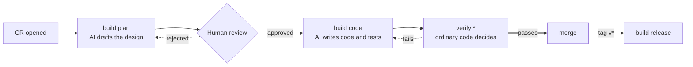

# MedHarness

**Design-control checks for software teams — traceability, verification, SOUP
and releases, as CI gates.**

[](https://pypi.org/project/medharness/)
[](LICENSE)
[](https://python.org)

MedHarness keeps a Design History File (DHF) as plain YAML in your repository
and checks it with ordinary code: does every requirement trace to its parent, is
each one verified the way it says, does the SOUP register match what ships. Each
check is a command that answers in JSON with an exit code, so it drops into any
CI. An optional AI workflow drafts the design and the code for a change request;
the checks never ask a model.

## Quick start

```bash
pip install medharness
mkdir my-device && cd my-device
medharness init            # writes DHF/ with sample items, and AGENTS.md
medharness verify dhf      # does the design hold together?
```

Replace the sample items with your own, then add the checks to CI.

## What it checks

| Command | The question it answers |
|---|---|
| `verify dhf` | Does the V-model hold together — schema, required links, dangling links, cycles, coverage? |
| `verify tests` | Is each requirement verified by the method it declares — a Test requirement by a passing test? |
| `verify soup` | Is the SOUP register what actually ships, and is any of it known-vulnerable? |
| `verify completion` | Is a change request's record complete, and is every item it changed verified? |
| `workflow check-changes` | Does the branch change exactly the items its change request lists? |
| `workflow check-approval` | Did a reviewer approve the exact commit being merged? |

```console
$ medharness verify dhf
FAIL [cycle] SRS-014 → SYS-006 → SRS-014
FAIL [required] SRS-022: SRS derives_from → SYS (count=0, need ≥1)
WARN [coverage] RISK→RCM: 3/4 covered
```

Broken structure — a cycle, a missing required link, a link to nothing — always
fails. Design not yet written — an item with no child yet — only warns, unless
you pass `--fail-on-uncovered`.

## What a project looks like

```
my-device/
├── DHF/
│   ├── config/global.yaml       # the project name — and only what you change
│   └── items/                   # one YAML file per item, one directory per type
│       ├── 01_crs/CRS-001.yaml
│       ├── 03_srs/SRS-001.yaml
│       └── …                    # UC SYS SYSARCH MODULE SWDD RISK RCM SOUP CR DEF REL
├── AGENTS.md                    # product context and DHF steps, for any coding agent
└── CLAUDE.md                    # @AGENTS.md, so Claude Code reads it too
```

The 13 item types, their lifecycles, which links are required, and the
specification templates are **defaults inside the package**, so a project gets
their improvements by upgrading `medharness`. To change one, override it:

| To change | Do this |
|---|---|
| A setting, e.g. which links are required | Set its key in `global.yaml` — it replaces the default key |
| An item type's fields | Put `DHF/config/doc_types/<type>.yaml` — it replaces the default type of that code |
| A new item type | Add a file there with a new `code` |
| A type you don't use | `omit_doc_types: [UC]` in `global.yaml` |
| A specification template | Put a file of the same name in `DHF/documents/specs/` |

The defaults are in
[`dhfkit/templates/config`](dhfkit/templates/config) and
[`dhfkit/templates/specs`](dhfkit/templates/specs).

An item is a small YAML file. Links are written on the child and point up:

```yaml
id: SRS-012
title: Password must be at least 12 characters
derives_from: [SYS-004]
verification_method: [Test]
testing: |
  T1: an 11-character password is rejected
```

## Fitting it into what you already have

- **Tests.** Any runner that writes JUnit XML. Tag each test case with the
  requirement it verifies — the `medharness.links` property, or `@links:SRS-012`
  in the test name. In pytest: `@pytest.mark.dhf_links("SRS-012")`.
- **CI.** Every check prints JSON to stdout and exits `0` pass, `1` fail. The
  smallest useful pipeline is two steps in a job that checks out the repository:

  ```yaml
  - run: pip install medharness==0.43.2
  - run: medharness verify dhf --fail-on-uncovered
  ```

  The full recipe, including the release job, is in
  [adopting.md](docs/adopting.md#setting-up-ci).
- **Requirements kept elsewhere.** MedHarness reads the item files under
  `DHF/items/`. To check requirements that live in another tool, export them
  into that format — one YAML file per item — and run the same commands. The
  format is specified in [interface.md](docs/interface.md#the-item-format--integrating-another-system).
- **No AI.** Nothing above needs a model. The AI workflow below is opt-in.

## The AI change workflow (optional)

The same steps run two ways. **In CI**, `build plan` and `build code` start a
model and do the work unattended. **At your desk**, the coding agent you
already use does it: `build plan --cr CR-012 --prompt` prints the steps and the
CR's DHF context instead of starting anything, and the `AGENTS.md` that `init`
writes tells any agent — Claude Code, Cursor, Codex, Copilot and the rest —
when to run it. Either way, ordinary code checks the result.


```mermaid
flowchart LR
    CR["CR opened"] --> PLAN["build plan<br/>AI drafts the design"]
    PLAN --> REV{"Human review"}
    REV -.->|rejected| PLAN
    REV -->|approved| CODE["build code<br/>AI writes code and tests"]
    CODE --> GATES["verify *<br/>ordinary code decides"]
    GATES -.->|fails| CODE
    GATES ==>|passes| MERGE["merge"]
    MERGE -.->|"tag v*"| REL["build release"]
```

Unattended, `build plan` and `build code` run the `claude` CLI by default
(`npm install -g @anthropic-ai/claude-code`), or any
`MEDHARNESS_{DESIGN,DESIGN_REVIEW,DEVELOP,CODE_REVIEW}_MODEL=provider:model`
(`anthropic`, `openai`, `deepseek`; `MEDHARNESS_{STAGE}_BASE_URL` for Azure,
Ollama or vLLM). They run an agent with a shell, so run them on an ephemeral CI
runner — read [ai-security.md](docs/ai-security.md) first.

## Commands

Two CLIs from one package: `medharness` runs the checks and the workflow;
`dhfkit` stores and reads the items. Both take `--dhf PATH` before the command,
defaulting to `DHF`. Every command writes JSON to stdout and readable lines to
stderr; `--help` on any of them lists its options.

### `verify` — reads the DHF only

| Command | Returns |
|---|---|
| `medharness verify dhf` | gate result¹ |
| `medharness verify tests --junit test-results` | gate result |
| `medharness verify soup` | gate result |
| `medharness verify completion --cr CR-034` | gate result |

### `workflow` — needs Git or GitHub; CI helpers

| Command | What it does | Returns |
|---|---|---|
| `medharness workflow check-changes --cr CR-034` | Compares the branch diff with the CR's `affected_items`, both ways | gate result |
| `medharness workflow check-approval --pr 42` | Requires an approving review of the PR's head commit; needs `GH_TOKEN` | gate result |

¹ Every gate answers `{gate, passed, summary, errors, warnings}`; see
[interface.md](docs/interface.md).

### `build` — writes items, code or artifacts

| Command | What it does | Returns |
|---|---|---|
| `medharness build plan --cr CR-034` | AI drafts the CR's design items and impact analysis; `--prompt` prints the steps for an agent already running | `outcome`, `artifacts.items_changed`, `design_review`, `errors` |
| `medharness build code --cr CR-034` | AI writes the code and tests for the approved design; `--prompt` likewise | `outcome`, `artifacts.files_changed`, `code_review`, `errors` |
| `medharness build soup --write` | Reconciles SOUP items with your dependency manifests; without `--write`, only reports | `to_create`, `to_update`, `orphans` |
| `medharness build release --version 1.0.0 --out-dir release --write` | Checks the DHF, CRs and open defects, writes the baseline, BOM, SBOM and evidence, and — only if every check passed — records the REL item | `outcome`, `cr_ids`, `rel_uid`, `artifacts`, `errors` |

### Setup

| Command | What it does | Returns |
|---|---|---|
| `medharness init` | Scaffolds `DHF/`, `AGENTS.md` and `CLAUDE.md` in the current directory, adding to either file if it exists; refuses if `DHF/` exists | `project_name`, `project_dir`, `created` |
| `medharness doctor` | Checks Python, the CLIs, `gh` auth, and the DHF | `healthy`, `summary`, `checks` |

### `dhfkit` — the items

| Command | What it does | Returns |
|---|---|---|
| `dhfkit item list --type SYS` | Lists items of a type | one JSON object per line |
| `dhfkit item get SRS-012` | One item | the item, with every ID it links to in `all_linked_uids` |
| `dhfkit item create --type SRS --data '{...}'` | Adds an item; its ID is allocated | the item |
| `dhfkit item update SRS-012 --data '{...}'` | Merges fields into an item | the item |
| `dhfkit item transition CR-034 completed` | Moves an item through its lifecycle; without a state, lists where it can go | the item; without a state, `current_status` and `transitions` |
| `dhfkit validate` | Checks every item against its type's schema, and that no two files claim one ID | `valid`, `errors`, `item_count` |
| `dhfkit doc SRS --format html` | Renders a specification from the items — `md` by default, `html` or `pdf` (needs `medharness[docs]`); `ALL` for every type | `md_path`, plus `html_path` or `pdf_path` |
| `dhfkit sbom` | CycloneDX 1.6 SBOM from the SOUP register; `--output -` for stdout | `path`, `components`, `without_purl`, `changed` |

## Example project

[ContourLab](https://github.com/itercharles/ContourLab) is an example project
used to exercise MedHarness end to end: its DHF, its CI, and changes made
through the AI workflow.

## Documentation

| | |
|---|---|
| [adopting.md](docs/adopting.md) | starting fresh, the CI recipe, bringing an existing DHF, releases |
| [interface.md](docs/interface.md) | the gate result, exit codes, what may change |
| [ai-security.md](docs/ai-security.md) | what the AI stages can do, and running without them |
| [architecture.md](docs/architecture.md) | how the code is organised |
| [CHANGELOG.md](CHANGELOG.md) | version history |

## License

MIT. See [LICENSE](LICENSE).
