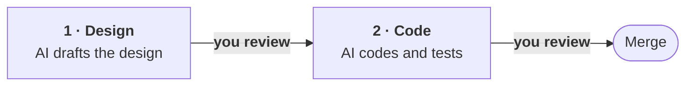

# MedHarness

**AI-assisted development with design control: your AI agent writes the code and
the design record, and ordinary code checks that they agree before anything
merges.**

[](https://pypi.org/project/medharness/)
[](LICENSE)
[](https://python.org)

## AI development


```mermaid
flowchart LR
    A["<b>1 · Design</b><br/>AI drafts the design"] -->|"<b>you review</b>"| B["<b>2 · Code</b><br/>AI codes and tests"]
    B -->|"<b>you review</b>"| C(["Merge"])
```

For each change request, the agent **designs** first — it assesses the change's
risk, then writes the requirements, design and test points it needs as items in
your repository's Design History File (DHF), each traced to the next — and
**codes** second, tagging each test with the requirement it verifies. You review
the design, then the code. Between them, ordinary code — never a model — checks
that the design traces, every requirement is verified, and the branch changed
what the request said.

What MedHarness gives the agent:

- **The process, in its own instructions.** `init` writes an `AGENTS.md` (and a
  `CLAUDE.md` that imports it) telling the agent when to open a change request
  and which commands to run; `build plan --prompt` prints the exact steps and
  this change's DHF context for whichever agent you use.
- **Commands instead of files.** The agent reads and writes the DHF with
  `medharness item`, which checks the schema first: a bad edit is refused, not
  saved.
- **Feedback it can act on.** The checks name the item and field that are
  wrong, so the agent fixes them and runs the check again.

Run it two ways:

- **At your desk**, with the agent you already use: it does the work in your
  working tree and you commit.
- **Unattended**, from an issue: CI opens the change request and a pull request
  with the design; ask for changes and it revises; the code stage runs the same
  way. The recipe is in [the AI workflow page](docs/ai-workflow.md#wiring-it-into-github-actions).

Unattended, `build plan` and `build code` run the `claude` CLI, or any
`provider:model` you set (`anthropic`, `openai`, `deepseek`, or a local
OpenAI-compatible endpoint such as `ollama`) — they run an agent
with a shell, so use an ephemeral runner and read
[ai-security.md](docs/ai-security.md) first.

## Quick start

```bash
pip install medharness
mkdir my-device && cd my-device
medharness init            # writes DHF/ with sample items, and AGENTS.md for your agent
```

Then ask your coding agent: *"open a CR for PDF export and implement it"*.
Or use the checks alone, with no AI: `medharness verify dhf` checks that the
design holds together.

## What a project looks like

```
my-device/
├── DHF/
│   ├── config/global.yaml       # the project name — and only what you change
│   └── items/                   # one YAML file per item, one directory per type
│       ├── 01_crs/CRS-001.yaml
│       ├── 03_srs/SRS-001.yaml
│       └── …                    # one directory per configured type
├── AGENTS.md                    # product context and DHF steps, for any coding agent
└── CLAUDE.md                    # @AGENTS.md, so Claude Code reads it too
```

The item types (13 by default), their fields and lifecycles, the required links
and the specification templates are defaults shipped in the package, so
upgrading `medharness` upgrades them. A project overrides only what it changes,
in `DHF/config/`: see [Changing the defaults](docs/configuration.md#changing-the-defaults).

An item is a small YAML file. Links are written on the child and point up:

```yaml
id: SRS-012
title: Password must be at least 12 characters
derives_from: [SYS-004]
verification_method: [Test]
testing: |
  T1: an 11-character password is rejected
```

## Commands

One CLI, four groups:

```
medharness init
medharness item    list | get | create | update | transition
medharness verify  dhf | tests | soup | completion | changes
medharness build   plan | code | soup | release
```

`item` reads and changes DHF items, `verify` checks and writes nothing, `build`
produces items, code and release artifacts. Every command's options and what it
returns are in [interface.md](docs/interface.md#command-reference); `--help` on
any command prints the same.

## Example project

[ContourLab](https://github.com/itercharles/ContourLab) is an example project
used to exercise MedHarness end to end: its DHF, its CI, and changes made
through AI development.

## Documentation

| | |
|---|---|
| [adopting.md](docs/adopting.md) | starting fresh, bringing an existing DHF, what to adopt in what order |
| [ci.md](docs/ci.md) | the CI recipe, cutting a release |
| [ai-workflow.md](docs/ai-workflow.md) | a change request from design to code: your own agent, or unattended in CI |
| [soup.md](docs/soup.md) | the SOUP register, SBOM, vulnerability scanning |
| [configuration.md](docs/configuration.md) | changing the defaults, your own types and relationships |
| [interface.md](docs/interface.md) | the gate result, exit codes, what may change |
| [ai-security.md](docs/ai-security.md) | what the AI stages can do, and running without them |
| [architecture.md](docs/architecture.md) | how the code is organised |
| [CHANGELOG.md](CHANGELOG.md) | version history |

## License

MIT. See [LICENSE](LICENSE).
