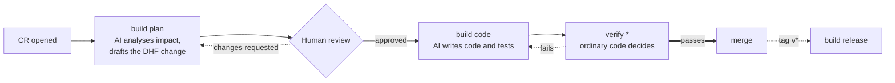

# MedHarness

**AI-assisted development with design control. For every change, an AI drafts
the design history — requirements, design, risk impact — and the code; ordinary
code checks that the two agree before anything merges.**

[](https://pypi.org/project/medharness/)
[](LICENSE)
[](https://python.org)

Regulated software needs a Design History File (DHF): every change traced from
requirement to design to test, with its risks assessed. MedHarness keeps the DHF
as plain YAML in your repository and makes it part of AI development: the agent
that writes the code also writes the DHF change, and deterministic checks, not a
model, decide whether the result traces and is verified.

## Quick start

```bash
pip install medharness
mkdir my-device && cd my-device
medharness init            # writes DHF/ with sample items, and AGENTS.md for your agent
```

Then ask your coding agent: *"open a CR for PDF export and implement it"*.
`AGENTS.md` tells it how: open a change request, draft the DHF change, write the
code, run the checks.

## AI development

Every change is a change request (CR) that goes through two stages, each ending
in a human review — of the pull request in CI, of the diff at your desk:


```mermaid
flowchart LR
    CR["CR opened"] --> PLAN["build plan<br/>AI analyses impact,<br/>drafts the DHF change"]
    PLAN --> REV{"Human review"}
    REV -.->|changes requested| PLAN
    REV -->|approved| CODE["build code<br/>AI writes code and tests"]
    CODE --> GATES["verify *<br/>ordinary code decides"]
    GATES -.->|fails| CODE
    GATES ==>|passes| MERGE["merge"]
    MERGE -.->|"tag v*"| REL["build release"]
```

`build plan` triages the CR, assesses its impact on risk, and writes the item
cascade it needs — requirements, design, test points — and an implementation
plan. `build code` implements that plan with tests linked to the requirements.
The same stages run two ways:

- **At your desk, with the agent you already use.** `build plan --cr CR-012
  --prompt` prints the stage's steps and the CR's DHF context, and starts
  nothing; your agent — Claude Code, Cursor, Codex, Copilot and the rest — does
  the work in your working tree, and you commit. The `AGENTS.md` that `init`
  writes tells any agent when to run it.
- **Fully automated in CI.** An issue starts it: the pipeline opens the CR,
  `build plan` drafts the design into a pull request, a reviewer approves or asks
  for changes — `build plan --pr N` revises from the review — and `build code`
  does the same for the code. The recipe, from issue label to merge, is in
  [adopting.md](docs/adopting.md#wiring-it-into-github-actions).

In CI, `build plan` and `build code` run the `claude` CLI by default
(`npm install -g @anthropic-ai/claude-code`), or any
`MEDHARNESS_{DESIGN,DESIGN_REVIEW,DEVELOP,CODE_REVIEW}_MODEL=provider:model`
(`anthropic`, `openai`, `deepseek`; `MEDHARNESS_{STAGE}_BASE_URL` for Azure,
Ollama or vLLM). They run an agent with a shell, so run them on an ephemeral CI
runner — read [ai-security.md](docs/ai-security.md) first.

## What a project looks like

```
my-device/
├── DHF/
│   ├── config/global.yaml       # the project name — and only what you change
│   └── items/                   # one YAML file per item, one directory per type
│       ├── 01_crs/CRS-001.yaml
│       ├── 03_srs/SRS-001.yaml
│       └── …                    # one directory per configured type
├── AGENTS.md                    # product context and DHF steps, for any coding agent
└── CLAUDE.md                    # @AGENTS.md, so Claude Code reads it too
```

The item types (13 by default), their fields and lifecycles, the required links
and the specification templates are defaults shipped in the package, so
upgrading `medharness` upgrades them. A project overrides only what it changes,
in `DHF/config/`: see [Changing the defaults](docs/adopting.md#changing-the-defaults).

An item is a small YAML file. Links are written on the child and point up:

```yaml
id: SRS-012
title: Password must be at least 12 characters
derives_from: [SYS-004]
verification_method: [Test]
testing: |
  T1: an 11-character password is rejected
```

## Commands

One CLI, four groups:

```
medharness init
medharness item    list | get | create | update | transition
medharness verify  dhf | tests | soup | completion | changes
medharness build   plan | code | soup | release
```

`item` reads and changes DHF items, `verify` checks and writes nothing, `build`
produces items, code and release artifacts. Every command's options and what it
returns are in [interface.md](docs/interface.md#command-reference); `--help` on
any command prints the same.

## Example project

[ContourLab](https://github.com/itercharles/ContourLab) is an example project
used to exercise MedHarness end to end: its DHF, its CI, and changes made
through AI development.

## Documentation

| | |
|---|---|
| [adopting.md](docs/adopting.md) | starting fresh, the CI recipe, bringing an existing DHF, releases |
| [interface.md](docs/interface.md) | the gate result, exit codes, what may change |
| [ai-security.md](docs/ai-security.md) | what the AI stages can do, and running without them |
| [architecture.md](docs/architecture.md) | how the code is organised |
| [CHANGELOG.md](CHANGELOG.md) | version history |

## License

MIT. See [LICENSE](LICENSE).
