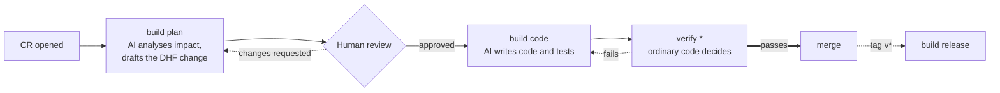

# MedHarness

**AI-assisted development with design control. For every change, an AI drafts
the design history — requirements, design, risk impact — and the code; ordinary
code checks that the two agree before anything merges.**

[](https://pypi.org/project/medharness/)
[](LICENSE)
[](https://python.org)

Regulated software needs a Design History File (DHF): every change traced from
requirement to design to test, with its risks assessed. MedHarness keeps the DHF
as plain YAML in your repository and makes it part of AI development: the agent
that writes the code also writes the DHF change, and deterministic checks, not a
model, decide whether the result traces and is verified.

## Quick start

```bash
pip install medharness
mkdir my-device && cd my-device
medharness init            # writes DHF/ with sample items, and AGENTS.md for your agent
```

Then ask your coding agent: *"open a CR for PDF export and implement it"*.
`AGENTS.md` tells it how: open a change request, draft the DHF change, write the
code, run the checks.

## AI development

Every change is a change request (CR) that goes through two stages, each ending
in a human review — of the pull request in CI, of the diff at your desk:


```mermaid
flowchart LR
    CR["CR opened"] --> PLAN["build plan<br/>AI analyses impact,<br/>drafts the DHF change"]
    PLAN --> REV{"Human review"}
    REV -.->|changes requested| PLAN
    REV -->|approved| CODE["build code<br/>AI writes code and tests"]
    CODE --> GATES["verify *<br/>ordinary code decides"]
    GATES -.->|fails| CODE
    GATES ==>|passes| MERGE["merge"]
    MERGE -.->|"tag v*"| REL["build release"]
```

`build plan` triages the CR, assesses its impact on risk, and writes the item
cascade it needs — requirements, design, test points — and an implementation
plan. `build code` implements that plan with tests linked to the requirements.
The same stages run two ways:

- **At your desk, with the agent you already use.** `build plan --cr CR-012
  --prompt` prints the stage's steps and the CR's DHF context, and starts
  nothing; your agent — Claude Code, Cursor, Codex, Copilot and the rest — does
  the work in your working tree, and you commit. The `AGENTS.md` that `init`
  writes tells any agent when to run it.
- **Fully automated in CI.** An issue starts it: the pipeline opens the CR,
  `build plan` drafts the design into a pull request, a reviewer approves or asks
  for changes — `build plan --pr N` revises from the review — and `build code`
  does the same for the code. The recipe, from issue label to merge, is in
  [adopting.md](docs/adopting.md#wiring-it-into-github-actions).

In CI, `build plan` and `build code` run the `claude` CLI by default
(`npm install -g @anthropic-ai/claude-code`), or any
`MEDHARNESS_{DESIGN,DESIGN_REVIEW,DEVELOP,CODE_REVIEW}_MODEL=provider:model`
(`anthropic`, `openai`, `deepseek`; `MEDHARNESS_{STAGE}_BASE_URL` for Azure,
Ollama or vLLM). They run an agent with a shell, so run them on an ephemeral CI
runner — read [ai-security.md](docs/ai-security.md) first.

## What a project looks like

```
my-device/
├── DHF/
│   ├── config/global.yaml       # the project name — and only what you change
│   └── items/                   # one YAML file per item, one directory per type
│       ├── 01_crs/CRS-001.yaml
│       ├── 03_srs/SRS-001.yaml
│       └── …                    # one directory per configured type
├── AGENTS.md                    # product context and DHF steps, for any coding agent
└── CLAUDE.md                    # @AGENTS.md, so Claude Code reads it too
```

### Defaults, and what you override

MedHarness reads two layers. The **defaults** ship inside the package: 13 item
types — CRS, UC, SYS, SYSARCH, MODULE, SRS, SWDD, RISK, RCM, SOUP, CR, DEF, REL —
each with its fields and lifecycle, plus the rules for which links are required
and the templates for the specifications. **Your project** adds files under
`DHF/config/` and `DHF/documents/specs/`. Where your project has one, it is used
instead of the default; where it has none, the default applies. That is why a new
project's `global.yaml` holds only its name, and why upgrading `medharness`
upgrades every default you have not overridden.

An override replaces the whole default it names; it never merges into it. Each
kind of default is overridden in its own place:

| To change | Do this | Example |
|---|---|---|
| A setting, such as which links are required | Write that key in `DHF/config/global.yaml`. Your value replaces the default value of that key, so copy the default value and edit it | `required_traceability: [...]` — your list is the whole list |
| The fields or lifecycle of an item type | Add `DHF/config/doc_types/srs.yaml` with `code: SRS`. It replaces the default SRS, so start from a copy of the default | give SRS a `hazard_ref` field |
| An item type of your own | Add a file in the same folder with a new `code` | `code: HWR` for hardware requirements |
| An item type you don't use | List its code in `omit_doc_types` in `global.yaml` | `omit_doc_types: [UC]` |
| A specification template | Add a file of the same name in `DHF/documents/specs/` | your own `requirements_specification.md.j2` |

The trade-off: an overridden item type stops following the package's changes to
that type, so override only what you change. The defaults to copy from are in
[`dhfkit/templates/config`](dhfkit/templates/config) and
[`dhfkit/templates/specs`](dhfkit/templates/specs).

An item is a small YAML file. Links are written on the child and point up:

```yaml
id: SRS-012
title: Password must be at least 12 characters
derives_from: [SYS-004]
verification_method: [Test]
testing: |
  T1: an 11-character password is rejected
```

## Commands

One CLI. `--dhf PATH` goes before the command and defaults to `DHF`. Every
command writes JSON to stdout and readable lines to stderr; `--help` on any of
them lists its options. A failing check exits `1`.

### `item` — the records

| Command | What it does | Returns |
|---|---|---|
| `medharness item list --type SYS` | Lists items of a type | one JSON object per line |
| `medharness item get SRS-012` | One item | the item, with every ID it links to in `all_linked_uids` |
| `medharness item create --type SRS --data '{...}'` | Adds an item; its ID is allocated | the item |
| `medharness item update SRS-012 --data '{...}'` | Merges fields into an item; refuses what the schema would reject | the item |
| `medharness item transition CR-034 completed` | Moves an item through its lifecycle; without a state, lists where it can go | the item; without a state, `current_status` and `transitions` |

### `verify` — reads the DHF and the working tree, writes nothing

Ordinary code, never a model, decides whether a change is done; a team writing
its DHF by hand uses these the same way. Each answers `{gate, passed, summary,
errors, warnings}` — see [interface.md](docs/interface.md). Broken structure
always fails; what is only not yet written warns, unless you pass `--strict`.

| Command | Checks |
|---|---|
| `medharness verify dhf` | Schema, duplicate IDs, required and dangling links, cycles, coverage |
| `medharness verify tests --junit test-results` | Each requirement is verified by the method it declares |
| `medharness verify soup` | The SOUP register matches the manifests, and none of it is known-vulnerable |
| `medharness verify completion --cr CR-034` | A CR's record is complete and every item it changed is verified |
| `medharness verify changes --cr CR-034` | The branch diff against `origin/main`, uncommitted work included, matches the CR's `affected_items`, both ways |

### `build` — writes items, code or artifacts

| Command | What it does | Returns |
|---|---|---|
| `medharness build plan --cr CR-034` | AI drafts the CR's design items and impact analysis in the working tree, committing nothing; `--pr N` (CI) revises from that PR's reviews and pushes to it; `--prompt` prints the steps for an agent already running | `outcome`, `artifacts.items_changed`, `design_review`, `errors` |
| `medharness build code --cr CR-034` | AI writes the code and tests for the approved design; `--pr` and `--prompt` as for `plan` | `outcome`, `artifacts.files_changed`, `code_review`, `errors` |
| `medharness build soup` | Reconciles SOUP items with your dependency manifests, in the working tree | `to_create`, `to_update`, `orphans` |
| `medharness build release --version 1.0.0 --out-dir release --write` | Checks the DHF, CRs and open defects; writes the specifications, traceability, baseline, BOM, SBOM and evidence; and — only if every check passed — records the REL item. Without `--write` the DHF is not changed | `outcome`, `cr_ids`, `rel_uid`, `artifacts`, `errors`, `warnings` |

Approval has no command. Turn on GitHub branch protection for `main` with
*Require approvals* and *Dismiss stale pull request approvals when new commits
are pushed*: GitHub then refuses a merge unless the commit being merged was
approved.

### Setup

| Command | What it does | Returns |
|---|---|---|
| `medharness init` | Scaffolds `DHF/`, `AGENTS.md` and `CLAUDE.md` in the current directory, adding to either file if it exists; refuses if `DHF/` exists | `project_name`, `project_dir`, `created` |

## Example project

[ContourLab](https://github.com/itercharles/ContourLab) is an example project
used to exercise MedHarness end to end: its DHF, its CI, and changes made
through AI development.

## Documentation

| | |
|---|---|
| [adopting.md](docs/adopting.md) | starting fresh, the CI recipe, bringing an existing DHF, releases |
| [interface.md](docs/interface.md) | the gate result, exit codes, what may change |
| [ai-security.md](docs/ai-security.md) | what the AI stages can do, and running without them |
| [architecture.md](docs/architecture.md) | how the code is organised |
| [CHANGELOG.md](CHANGELOG.md) | version history |

## License

MIT. See [LICENSE](LICENSE).
